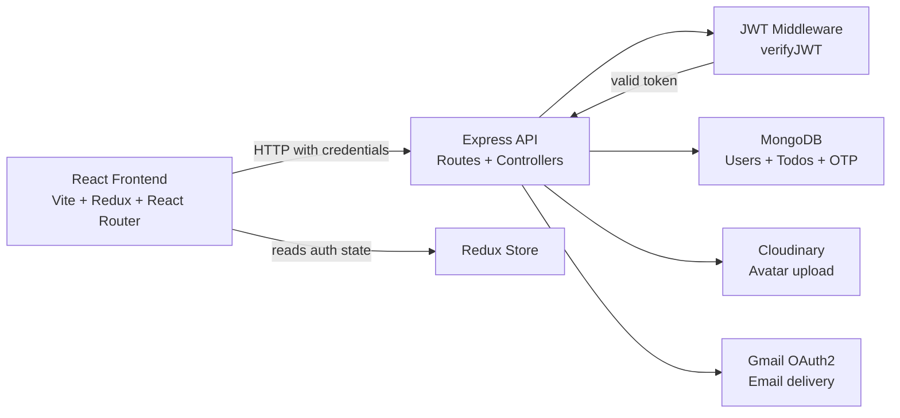
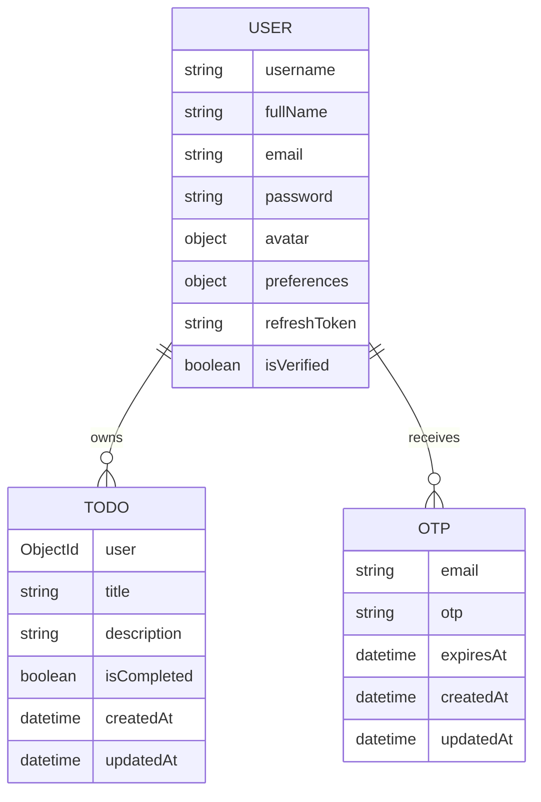

# Taskly

Taskly is a full-stack task management application for personal productivity, user account management, and secure todo tracking. The project combines a React + Redux frontend with an Express + MongoDB backend to provide account signup, email verification, JWT session handling, profile management, and a private todo dashboard.

The current implementation is a single-user productivity app rather than a multi-tenant SaaS platform. It focuses on account lifecycle, security, and personal task management for one authenticated user at a time.

## Why this project exists

Taskly solves the common problem of juggling tasks, deadlines, and personal workflow in a simple interface without introducing unnecessary complexity. The application stores todo data per authenticated user, supports password recovery and verified signup, and keeps user preferences and profile data in sync across the app.

## Features

### User account and authentication

- User registration with full name, email, username, and password validation
- Email verification through a 6-digit OTP flow
- Login using either email or username
- Access token and refresh token generation
- HTTP-only cookie-based authentication
- Logout and token cleanup
- Password reset flow using email OTP verification
- Current user hydration through the authenticated profile endpoint

### Todo management

- Create todos with a required title and optional description
- Fetch all todos owned by the current user
- Fetch a single todo by ID
- Update a todo title and description
- Toggle completion status
- Delete a todo

### Profile and account settings

- Update username and full name
- Upload and replace an avatar image
- Remove avatar image
- Change password while signed in
- Toggle between light and dark theme preferences

### Frontend experience

- Public landing and informational pages
- Auth-only routes for login, registration, OTP verification, and reset flows
- Protected dashboard and settings routes
- Redux-based authentication and todo state management

## Screenshots

No screenshots are currently included in this repository. This README intentionally does not reference image files that do not exist.

If you want to add product screenshots later, add them in a pull request and then insert the relevant image references here.

## Tech stack

### Frontend

- React 19
- Vite
- Redux Toolkit
- React Router DOM
- Axios
- Tailwind CSS
- Lucide React
- ESLint

### Backend

- Node.js
- Express 5
- MongoDB
- Mongoose 9
- JWT
- bcryptjs
- Nodemailer
- Cloudinary
- Multer
- Helmet
- CORS
- Express Rate Limit
- dotenv

### Authentication and integrations

- JWT access/refresh tokens for session management
- Secure HTTP-only cookies for the browser session
- Gmail OAuth2 transport configuration for sending email
- Cloudinary for avatar uploads
- MongoDB TTL indexing for OTP expiry

## Architecture

The application is split into a frontend client and a backend API. The client loads the current session through an authenticated request, stores user and todo state in Redux, and routes users between public, auth-only, and protected views.



The runtime flow is:

1. The frontend initializes the app and calls the authenticated current-user endpoint.
2. Redux stores the authenticated user and loading state.
3. Route guards prevent unauthenticated access to protected pages and signed-in users from accessing auth flows.
4. Protected API calls include browser cookies automatically because the client is configured with `withCredentials: true`.
5. The backend verifies tokens in middleware and attaches the authenticated user to the request object.
6. Controllers enforce ownership checks so a user only sees and edits their own todo data.

## Project structure

```text
Full Stack Todo/
├── LICENSE
├── README.md
├── backend/
│   ├── package.json
│   ├── package-lock.json
│   ├── public/
│   └── src/
│       ├── app.js
│       ├── constant.js
│       ├── index.js
│       ├── config/
│       │   └── config.js
│       ├── controllers/
│       │   ├── todo.controller.js
│       │   ├── user.controller.js
│       │   └── userManagement.controller.js
│       ├── db/
│       │   └── index.js
│       ├── middlewares/
│       │   ├── auth.middleware.js
│       │   └── multer.middleware.js
│       ├── models/
│       │   ├── PasswordReset.model.js
│       │   ├── otp.model.js
│       │   ├── todo.model.js
│       │   └── user.model.js
│       ├── routes/
│       │   ├── todo.route.js
│       │   ├── user.route.js
│       │   └── userManagement.route.js
│       ├── service/
│       │   └── email.service.js
│       └── utils/
│           ├── ApiError.js
│           ├── ApiResponse.js
│           ├── asyncHandler.js
│           ├── otp.utils.js
│           ├── response.utils.js
│           ├── token.utils.js
│           ├── uploadOnCloudinary.js
│           └── user.utils.js
├── frontend/
│   ├── eslint.config.js
│   ├── index.html
│   ├── package.json
│   ├── package-lock.json
│   ├── postcss.config.js
│   ├── tailwind.config.js
│   ├── vite.config.js
│   ├── public/
│   └── src/
│       ├── App.jsx
│       ├── index.css
│       ├── main.jsx
│       ├── app/
│       │   ├── features/
│       │   │   ├── authSlice.js
│       │   │   └── todoSlice.js
│       │   └── store/
│       │       └── store.js
│       ├── assets/
│       ├── components/
│       │   ├── Axios/
│       │   ├── Error/
│       │   ├── ForgotPasswordCMP/
│       │   ├── Home/
│       │   ├── Landing/
│       │   ├── Login/
│       │   ├── NavBar/
│       │   ├── PrivacyCMP/
│       │   ├── Register/
│       │   ├── ResetPasswordCMP/
│       │   ├── Setting/
│       │   ├── TermsCMP/
│       │   ├── Todo/
│       │   ├── TodoCard/
│       │   ├── TodoContent/
│       │   ├── TodoHeader/
│       │   ├── VerifyEmail/
│       │   └── VerifyOTPCMP/
│       ├── Pages/
│       │   ├── Footer/
│       │   ├── ForgotPassword/
│       │   ├── Help/
│       │   ├── Home/
│       │   ├── LandingPage/
│       │   ├── Login/
│       │   ├── Privacy/
│       │   ├── Register/
│       │   ├── ResetPassword/
│       │   ├── Setting/
│       │   ├── Term/
│       │   ├── VerifyEmail/
│       │   └── VerifyOTP/
│       └── routes/
│           ├── AuthRoutes/
│           ├── ProtectedRoutes/
│           ├── PublicRoutes/
│           └── index.js
```

## Prerequisites

- Node.js 18+ recommended for the current frontend and backend toolchain
- MongoDB instance or MongoDB-compatible local database
- Cloudinary account for avatar uploads
- Gmail account configured for OAuth2 email sending
- A browser for the frontend app

## Installation and local setup

### 1. Clone the repository

```bash
git clone <your-repository-url>
cd "Full Stack Todo"
```

### 2. Install backend dependencies

```bash
cd backend
npm install
```

### 3. Configure the backend environment

Create a `.env` file inside the `backend` directory with the required values.

### 4. Start the backend

```bash
npm run dev
```

This runs the application from `backend/src/index.js`.

### 5. Install frontend dependencies

```bash
cd ../frontend
npm install
```

### 6. Configure the frontend environment

Create a `.env` or `.env.local` file inside the `frontend` directory with:

```env
VITE_API_URL=http://localhost:3000/v1/api
```

### 7. Start the frontend

```bash
npm run dev
```

The Vite dev server typically runs on `http://localhost:5173` unless otherwise configured.

### 8. Production build

From the frontend directory:

```bash
npm run build
```

From the backend directory:

```bash
npm run start
```

## Environment variables

The backend reads environment variables from `backend/.env` and validates them on startup in `backend/src/config/config.js`.

```env
PORT=3000
MONGODB_URI=mongodb://localhost:27017
CORS_ORIGIN=http://localhost:5173
ACCESS_TOKEN_SECRET=replace-with-long-random-secret
ACCESS_TOKEN_EXPIRY=1d
REFRESH_TOKEN_SECRET=replace-with-long-random-secret
REFRESH_TOKEN_EXPIRY=7d
CLOUDINARY_CLOUD_NAME=your-cloud-name
CLOUDINARY_API_KEY=your-api-key
CLOUDINARY_API_SECRET=your-api-secret
GOOGLE_CLIENT_ID=your-google-client-id
GOOGLE_CLIENT_SECRET=your-google-client-secret
GOOGLE_REFRESH_TOKEN=your-google-refresh-token
EMAIL_USER=your-gmail-address
RESET_PASSWORD_TOKEN=replace-with-password-reset-secret
RESET_PASSWORD_TOKEN_EXPIRY=10m
```

The frontend reads the API base URL from `frontend/.env`:

```env
VITE_API_URL=http://localhost:3000/v1/api
```

Notes:

- These values are required by the project configuration and are checked when the backend starts.
- Do not commit real secrets or tokens to the repository.
- The Gmail OAuth2 variables are used to send verification and reset emails through the configured Gmail account.

## API documentation

All routes are mounted under the backend base namespace:

- `/v1/api/auth/*`
- `/v1/api/user/*`
- `/v1/api/todo/*`

### Authentication endpoints

| Method | Endpoint | Auth required | Description |
| --- | --- | --- | --- |
| GET | `/healthz` | No | Health-check route for the backend. |
| POST | `/v1/api/auth/register` | No | Create a user and send an email verification OTP. |
| POST | `/v1/api/auth/verify-email` | No | Verify a 6-digit OTP and mark the user as verified. |
| POST | `/v1/api/auth/login` | No | Log in with `identifier` and `password`; sets auth cookies. |
| POST | `/v1/api/auth/logout` | Yes | Clears access and refresh cookies and clears the refresh token. |
| GET | `/v1/api/auth/me` | Yes | Returns the current authenticated user. |
| POST | `/v1/api/auth/request-password-reset` | No | Sends a password reset OTP to the user email. |
| POST | `/v1/api/auth/verify-otp` | No | Verifies password reset OTP and returns a reset token. |
| PATCH | `/v1/api/auth/reset-password` | No | Validates the reset token and changes the password. |
| POST | `/v1/api/auth/resend-otp` | No | Resends the registration OTP. |
| PATCH | `/v1/api/auth/refresh-access-token` | No | Refresh endpoint is defined in the router and implemented in the controller. |

### User management endpoints

| Method | Endpoint | Auth required | Description |
| --- | --- | --- | --- |
| PATCH | `/v1/api/user/change-password` | Yes | Change password using the current password and a new password. |
| PATCH | `/v1/api/user/update-profile` | Yes | Update `username`, `fullName`, and optionally upload a JPEG avatar. |
| PATCH | `/v1/api/user/delete-avatar` | Yes | Remove the current avatar from Cloudinary and clear the stored avatar reference. |
| PATCH | `/v1/api/user/toggle-theme` | Yes | Set the theme to `light` or `dark` in the user preferences. |

### Todo endpoints

| Method | Endpoint | Auth required | Description |
| --- | --- | --- | --- |
| POST | `/v1/api/todo/todos` | Yes | Create a new todo. |
| GET | `/v1/api/todo/todos` | Yes | List all todos for the authenticated user. |
| GET | `/v1/api/todo/todos/:todoId` | Yes | Fetch one todo by ID if it belongs to the user. |
| PATCH | `/v1/api/todo/todos/:todoId` | Yes | Update the todo title and description. |
| PATCH | `/v1/api/todo/todos/:todoId/toggle` | Yes | Toggle the completion status. |
| DELETE | `/v1/api/todo/todos/:todoId` | Yes | Remove the todo. |

### Request format notes

- `POST /v1/api/auth/register` expects `fullName`, `email`, `username`, and `password`.
- `POST /v1/api/auth/login` expects `identifier` and `password`.
- `POST /v1/api/auth/verify-email` expects `email` and `otp`.
- `POST /v1/api/auth/request-password-reset` expects `email`.
- `POST /v1/api/auth/verify-otp` expects `email` and `otp`.
- `PATCH /v1/api/auth/reset-password` expects `resetToken`, `newPassword`, and `confirmPassword`.
- `PATCH /v1/api/user/update-profile` accepts multipart form data. The avatar file must be JPEG (`image/jpeg` or `.jpg`/`.jpeg`).
- `PATCH /v1/api/user/change-password` expects `oldPassword` and `newPassword`.

### Response format

The backend uses a consistent success wrapper from `sendResponse()`:

```json
{
  "statusCode": 200,
  "data": { "_id": "..." },
  "message": "Operation completed successfully",
  "success": true
}
```

Error responses follow the global Express error middleware format:

```json
{
  "success": false,
  "message": "Invalid credentials",
  "errors": []
}
```

## Authentication and security

Taskly uses JWT-based authentication with cookies for browser sessions.

- The `verifyJWT` middleware checks `req.cookies.accessToken` first and falls back to the `Authorization: Bearer ...` header.
- Access tokens are signed using `ACCESS_TOKEN_SECRET` and validated with `jwt.verify()`.
- Refresh tokens are persisted on the user record and verified during the refresh endpoint.
- Cookies are configured with `httpOnly`, `secure`, and `sameSite: "strict"`.
- User passwords are hashed in the Mongoose `pre("save")` hook with `bcryptjs`.
- OTP values are also hashed before storage and compared against a bcrypt hash on verification.
- Public API routes and protected routes are rate limited with `express-rate-limit`.
- The app enables `helmet()` and CORS with a configured origin.

The email verification and password reset flows are as follows:

1. A user registers and receives a 6-digit OTP.
2. The code must be verified before `isVerified` is set to `true`.
3. A verified user can request a password reset OTP.
4. The client submits the verified OTP and receives a signed reset token.
5. The token is used to set a new password; the previous refresh token is cleared in the process.

## Database design

The project uses MongoDB via Mongoose. The most important collections are `User`, `Todo`, and `OTP`.

### User schema

Key fields:

- `username`: unique, lowercase, 3–20 characters, alphanumeric/underscore only
- `fullName`: required, trimmed string
- `email`: unique, validated email
- `password`: hashed password
- `avatar`: object with `url` and `public_id`
- `preferences.theme`: `light` or `dark`
- `refreshToken`: stored refresh token value
- `isVerified`: boolean indicating whether the user completed email verification
- timestamps

### Todo schema

Key fields:

- `user`: reference to the owning user
- `title`: required todo title
- `description`: optional description string
- `isCompleted`: boolean completion flag
- timestamps

Every todo query is scoped by the authenticated user ID, which prevents cross-user access.

### OTP schema

- Stores `email`, `otp`, and `expiresAt`
- Hashes OTP values before saving
- Uses a MongoDB TTL index on `expiresAt`



## Deployment

No production deployment configuration or CI/CD pipeline is present in this repository.

The project is set up as a standard local development app with:

- a Node.js backend process using `npm run start`
- a Vite frontend build using `npm run build`
- a configured CORS origin and backend port

For production, you would still need to provide:

- a MongoDB service
- Cloudinary credentials
- Gmail OAuth2 credentials
- a valid `CORS_ORIGIN` pointing at the production frontend host
- a reverse proxy or hosting solution for the frontend and backend

## Available scripts

### Backend (`backend/package.json`)

```bash
npm run dev
npm run start
```

### Frontend (`frontend/package.json`)

```bash
npm run dev
npm run build
npm run lint
npm run preview
```

No automated test script was found in either package configuration.

## Contributing

Contributions are welcome. The recommended workflow is:

1. Fork the repository.
2. Create a feature branch from `main` or the default branch.
3. Make your changes in the relevant backend or frontend directory.
4. Verify the change locally with the same commands used during development.
5. Review the project structure and follow the existing patterns in controllers, routes, components, and Redux slices.
6. Open a pull request with a clear description of the update and any validation performed.

Please keep changes consistent with the existing architecture and avoid broad refactors without a clear reason.

## License

This project is licensed under the MIT License. See [LICENSE](LICENSE) for the full text.

## Acknowledgments and contact

No maintainer, social profile, or contact information is currently defined in this repository, so this section is intentionally omitted.

## Roadmap and limitations

### Current functionality

The project currently supports a private personal workflow for:

- signup and email verification
- login/logout
- authenticated todo list management
- profile updates and avatar upload
- password reset via OTP
- light/dark user theme selection

### Known limitations

- There is no automated test suite in the repository.
- There is no multi-user or team-based sharing model.
- There is no role-based authorization or admin management layer.
- Todo endpoints do not implement pagination or filtering beyond the simple fetch-all behavior.
- The backend exposes a `PasswordReset` model file, but the active flow implemented in `user.controller.js` uses a signed JWT reset token rather than this model directly.
- The theme validation allows `system`, but the actual `User` schema only permits `light` and `dark` values.
- The Gmail OAuth2 configuration is required for email delivery, and the project does not contain a fallback SMTP or alternative delivery mechanism.
- The frontend includes a Google OAuth dependency, but the current application flow does not validate a separate Google sign-in implementation.

## Summary

Taskly is a functional personal productivity application with a secure authentication layer, email verification, reset flows, and a todo dashboard. The repository is suitable for local development and experimentation, but it is not currently a production deployment package or a fully hardened multi-user SaaS product.

- file upload limit enforcement via Multer (`5 MB` max per file)
- Cloudinary avatar upload and cleanup of stale avatar assets
- validation for required fields, email format, username format, and password length

These measures improve security, but they do not make the application immune to all deployment or operational risks. The project should still be evaluated in a real production environment with careful secret management, monitoring, and threat review.

## Engineering highlights

The codebase includes several meaningful implementation decisions:

- centralised request handling with `asyncHandler` to reduce repetitive error flow
- standardised response formatting through `ApiResponse`
- consistent controller-level validation before database writes
- JWT authentication split between access-token validation and refresh-token lifecycle management
- secure cookie handling for session state instead of localStorage-only auth
- user ownership enforced at the data access layer for todo operations
- password reset and email verification flows built around short-lived OTPs
- Cloudinary integration for file upload and media cleanup
- Redux-based frontend state for authentication and todos, with route guards to enforce auth state

## Known limitations and current state

The application is functional but intentionally narrow in scope. Current limitations include:

- no automated tests exist in either the frontend or backend
- no pagination or filtering on the backend; list endpoints return all user todos
- todo operations are scoped to the authenticated user, but no team or shared-task model exists
- `refreshAccessToken` is registered as a route but does not appear to be implemented in controller logic
- the `toggle-theme` API allows `system`, but the `User` schema enum only accepts `light` and `dark`
- `@react-oauth/google` is present in `package.json`, but current code does not appear to wire Google OAuth login into the app flow
- `PasswordReset.model.js` exists as a model file but is not used anywhere in the current authentication flow
- the app performs file uploads to `./public/temp` and then deletes them after Cloudinary upload, which works for the current design but is not a production-scale asset pipeline
- no backend API documentation generator or formal OpenAPI spec is included
- frontend UX is polished, but there are still some legacy or unused code paths from earlier iterations of the app

## Roadmap

### Completed

- user registration and verification
- login/logout and auth cookie flow
- password reset flow with OTP
- personal todo CRUD and completion toggling
- profile updates and avatar management
- theme preference persistence
- dashboard and settings UI

### Current functionality

- single-user personal productivity workflow
- protected frontend routes with Redux session state
- MongodDB-backed persistence for users and todos
- cookie-based JWT authentication

### Future improvements

- add automated tests for backend and frontend behavior
- implement refresh-token rotation and session invalidation at scale
- add pagination and server-side filtering for larger todo collections
- clean up unused or stale code paths and model files
- formalize API documentation and contract testing
- review the theme model and API validation consistency
- consider a stronger production asset strategy for avatars and uploads
- evaluate OAuth or SSO options if the product grows beyond personal task tracking

## Final assessment

Taskly is a focused, real-world full-stack productivity application with secure authentication, profile management, and personal todo operations. It is not a broad multi-tenant SaaS product; it is a compact single-user system with a clear backend/frontend boundary and a security-conscious auth model.

The repository demonstrates practical implementation patterns for:

- JWT-based auth with cookies
- MongoDB-backed persistence
- OTP-driven email verification and password reset
- Redux state management on the client
- secured file uploads and avatar handling
- protected-route UI logic

It is a solid starting point for a small production-ready personal productivity app, with the main gaps being testing, API completeness review, and a few cleanup opportunities in the current implementation.


## AI Assistance

GitHub Copilot was used to assist with generating and refining this project's documentation. The project author is responsible for reviewing and maintaining the README.

