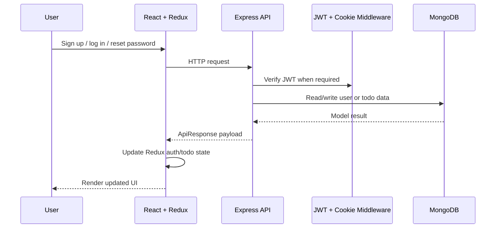
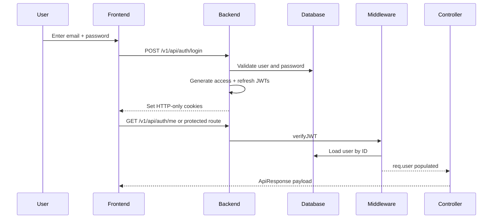
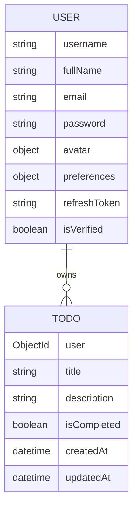

# Taskly

Taskly is a full-stack task management application with authenticated user accounts, email verification, password reset workflows, profile management, and personal todo tracking. The product is implemented as a React + Redux frontend and an Express + MongoDB backend, with JWT-based authentication and HTTP-only cookies for session state.

This repository represents a working personal productivity app rather than a broad SaaS platform. Its current scope is focused on user lifecycle management and personal task operations for a single authenticated user.

## Overview

Taskly allows a user to:

- create an account with username, full name, and password
- verify email with a 6-digit OTP
- log in and maintain a session using access and refresh tokens stored in secure cookies
- view and manage a personal todo list
- update profile information and avatar image
- change password
- reset password using a verified OTP flow
- toggle light/dark appearance preferences

The frontend is built in React with Vite and Redux Toolkit, while the backend uses Express.js, Mongoose, and MongoDB for persistence and auth logic.

## Product scope

This is a single-user task manager with authenticated account management. The codebase currently does not implement:

- team collaboration or shared tasks
- role-based access control
- admin panels
- pagination on list endpoints
- public API consumption layers beyond the app itself
- automated test suites

## Architecture



At runtime, the flow is:

1. The frontend loads the current user from `/auth/me` on startup.
2. The auth slice stores the user and authentication state in Redux.
3. Authenticated routes check `isAuthenticated` and `isLoading` before allowing navigation.
4. Protected API calls include credentials so browser cookies are sent automatically.
5. The backend verifies JWTs in middleware and attaches the authenticated user to the request.
6. Controllers enforce ownership checks for todos and user updates.

## Repository structure

```text
Full Stack Todo/
├── backend/
│   ├── public/
│   ├── src/
│   │   ├── app.js
│   │   ├── index.js
│   │   ├── constant.js
│   │   ├── config/
│   │   │   └── config.js
│   │   ├── controllers/
│   │   │   ├── todo.controller.js
│   │   │   ├── user.controller.js
│   │   │   └── userManagement.controller.js
│   │   ├── db/
│   │   │   └── index.js
│   │   ├── middlewares/
│   │   │   ├── auth.middleware.js
│   │   │   └── multer.middleware.js
│   │   ├── models/
│   │   │   ├── otp.model.js
│   │   │   ├── PasswordReset.model.js
│   │   │   ├── todo.model.js
│   │   │   └── user.model.js
│   │   ├── routes/
│   │   │   ├── todo.route.js
│   │   │   ├── user.route.js
│   │   │   └── userManagement.route.js
│   │   ├── service/
│   │   │   └── email.service.js
│   │   ├── utils/
│   │   │   ├── ApiError.js
│   │   │   ├── ApiResponse.js
│   │   │   ├── asyncHandler.js
│   │   │   ├── otp.utils.js
│   │   │   ├── response.utils.js
│   │   │   ├── token.utils.js
│   │   │   ├── uploadOnCloudinary.js
│   │   │   └── user.utils.js
│   │   └── ...
│   ├── package.json
│   └── ...
├── frontend/
│   ├── public/
│   ├── src/
│   │   ├── App.jsx
│   │   ├── main.jsx
│   │   ├── index.css
│   │   ├── app/
│   │   │   ├── features/
│   │   │   │   ├── authSlice.js
│   │   │   │   └── todoSlice.js
│   │   │   └── store/
│   │   │       └── store.js
│   │   ├── assets/
│   │   ├── components/
│   │   │   ├── Axios/
│   │   │   ├── Error/
│   │   │   ├── ForgotPasswordCMP/
│   │   │   ├── Home/
│   │   │   ├── Landing/
│   │   │   ├── Login/
│   │   │   ├── Navbar/
│   │   │   ├── Register/
│   │   │   ├── ResetPasswordCMP/
│   │   │   ├── Setting/
│   │   │   ├── Todo/
│   │   │   ├── TodoCard/
│   │   │   ├── TodoContent/
│   │   │   ├── TodoHeader/
│   │   │   ├── VerifyEmail/
│   │   │   └── VerifyOTPCMP/
│   │   ├── Pages/
│   │   ├── routes/
│   │   │   ├── AuthRoutes/
│   │   │   ├── ProtectedRoutes/
│   │   │   ├── PublicRoutes/
│   │   │   └── index.js
│   │   └── ...
│   ├── package.json
│   ├── vite.config.js
│   ├── tailwind.config.js
│   └── ...
├── README.md
└── ...
```

## Tech stack

### Frontend

- React 19
- Vite
- Redux Toolkit
- React Router DOM
- Axios for API calls
- Tailwind CSS for styling
- Lucide React for icons
- ESLint for linting

### Backend

- Node.js
- Express 5
- MongoDB
- Mongoose 9
- JWT for access and refresh tokens
- bcryptjs for password hashing and OTP hashing
- Nodemailer with Gmail OAuth2 for email delivery
- Cloudinary for avatar uploads
- Multer for local temp file handling
- Helmet for security headers
- CORS
- Express rate limiting
- dotenv for environment variables

## Features

### Authentication

- user registration with validation and unique username/email checks
- email verification via OTP
- OTP resend support after registration or reset request
- login using either email or username
- access-token and refresh-token generation
- secure cookie-based session handling
- logout and cookie cleanup
- password reset flow with OTP verification and reset token
- `GET /auth/me` to hydrate the current authenticated user in the client

### Todo management

- create todo with title and optional description
- fetch all todos for the authenticated user
- fetch a single todo by id
- update title and description
- toggle completion status
- delete todo
- UI-level client-side search, filter, and sort behavior in the page component set

### User settings

- update profile name and username
- upload avatar as JPEG only
- delete avatar image
- change password while authenticated
- toggle theme preference between light and dark

### Frontend routing and auth UX

- public landing page
- auth-only pages for login, registration, email verification, password reset flow
- protected dashboard and settings pages
- redirect logic to prevent signed-in users from visiting auth pages and unauthenticated users from visiting protected pages

## Authentication architecture

The backend uses JWT-based authentication with cookies:

- `generateAccessAndRefreshToken()` creates a refresh token and stores it on the user document.
- `login()` issues both tokens and sets them as `accessToken` and `refreshToken` cookies using `httpOnly`, `secure`, and `sameSite: "strict"` configuration.
- `verifyJWT` middleware reads the access token from cookies or `Authorization: Bearer ...` and verifies it using `ACCESS_TOKEN_SECRET`.
- `req.user` is populated with the authenticated user for controller access.
- `logout()` clears both cookies and sets `refreshToken` to `null` on the user record.



### Password reset flow

The current reset workflow is:

1. User submits email to `/auth/request-password-reset`.
2. Backend checks that the user exists and is verified.
3. A one-time OTP is generated and emailed.
4. Client verifies OTP at `/auth/verify-otp`.
5. Backend returns a signed reset token for the verified user.
6. Client submits `resetToken`, `newPassword`, and `confirmPassword` to `/auth/reset-password`.
7. Backend verifies the reset token, checks a password match, hashes the new password through the Mongoose pre-save hook, and updates the user.

### Email verification flow

Registration creates a new user and immediately sends an OTP to the provided email address. The user is not considered authenticated until they complete `/auth/verify-email` and the backend marks `isVerified = true`.

### Password hashing and OTP protection

- User passwords are hashed in the Mongoose `pre("save")` hook using `bcryptjs`.
- OTP documents are stored hashed, not in plaintext.
- OTP verification checks expiry and compares against a bcrypt hash.
- OTP documents include an expiration date with a MongoDB TTL index via `expiresAt` and `expireAfterSeconds: 0`.

## Database architecture

The application uses MongoDB via Mongoose. The main data model relationships are:

### User model

The `User` model stores:

- `username` — unique, lowercase, 3-20 chars, alphanumeric/underscore only
- `fullName` — required string, trimmed
- `email` — unique, validated email
- `password` — hashed password
- `avatar` — object containing `url` and `public_id`
- `preferences.theme` — `light` or `dark` default
- `refreshToken` — stored JWT reference for refresh flow
- `isVerified` — boolean, defaults to `false`
- timestamps

### Todo model

The `Todo` model stores:

- `user` — `ObjectId` reference to `User`
- `title` — required short string
- `description` — optional long string
- `isCompleted` — boolean default false
- timestamps

The model is intentionally scoped to a single owner: every todo query is filtered by `user: req.user._id`, so users can only access their own tasks.



## API reference

All routes are mounted under the versioned backend namespace:

- `/v1/api/auth/*`
- `/v1/api/user/*`
- `/v1/api/todo/*`

### Authentication endpoints

| Method | Endpoint | Auth | Description |
| --- | --- | --- | --- |
| GET | `/healthz` | No | Simple health-check route for the server. |
| POST | `/v1/api/auth/register` | No | Create user and send verification OTP. |
| POST | `/v1/api/auth/verify-email` | No | Verify OTP and mark the user as verified. |
| POST | `/v1/api/auth/login` | No | Authenticate with `identifier` + `password`; sets auth cookies. |
| POST | `/v1/api/auth/logout` | Yes | Clears cookies and nulls the stored refresh token. |
| GET | `/v1/api/auth/me` | Yes | Returns the current authenticated user. |
| POST | `/v1/api/auth/request-password-reset` | No | Sends OTP for a verified user to reset password. |
| POST | `/v1/api/auth/verify-otp` | No | Verifies reset OTP and returns a reset token. |
| PATCH | `/v1/api/auth/reset-password` | No | Validates a reset token and changes the password. |
| POST | `/v1/api/auth/resend-otp` | No | Resends OTP to the provided email. |
| PATCH | `/v1/api/auth/refresh-access-token` | No | Route exists in the router but is not implemented in controller logic in the current codebase. |

### User management endpoints

| Method | Endpoint | Auth | Description |
| --- | --- | --- | --- |
| PATCH | `/v1/api/user/change-password` | Yes | Change password using current password and new password. |
| PATCH | `/v1/api/user/update-profile` | Yes | Update username/full name and optionally upload an avatar carousel. |
| PATCH | `/v1/api/user/delete-avatar` | Yes | Delete the current avatar from Cloudinary and clear the DB reference. |
| PATCH | `/v1/api/user/toggle-theme` | Yes | Set `preferences.theme` to `light`, `dark`, or `system` according to validation logic; the schema currently only allows `light` and `dark`. |

### Todo endpoints

| Method | Endpoint | Auth | Description |
| --- | --- | --- | --- |
| POST | `/v1/api/todo/todos` | Yes | Create a todo for the authenticated user. |
| GET | `/v1/api/todo/todos` | Yes | Fetch all todos for the authenticated user. |
| GET | `/v1/api/todo/todos/:todoId` | Yes | Fetch one todo by id if it belongs to the user. |
| PATCH | `/v1/api/todo/todos/:todoId` | Yes | Update a todo owned by the user. |
| PATCH | `/v1/api/todo/todos/:todoId/toggle` | Yes | Toggle completion state. |
| DELETE | `/v1/api/todo/todos/:todoId` | Yes | Delete a todo owned by the user. |

## Request and response behavior

The project uses a consistent API response wrapper defined by `ApiResponse`:

```json
{
  "statusCode": 200,
  "data": { "_id": "..." },
  "message": "User logged in successfully",
  "success": true
}
```

Error responses are returned by the global Express error handler with:

```json
{
  "success": false,
  "message": "Invalid credentials",
  "errors": []
}
```

The code validates input in controllers and returns `ApiError` instances with status codes such as `400`, `401`, `404`, and `409`.

## Frontend state management

The frontend uses Redux Toolkit with two slices:

- `authSlice` — stores authentication state and current user
- `todoSlice` — stores todo collection and loading state

The root store is configured in `frontend/src/app/store/store.js`.

Relevant behavior:

- `App.jsx` calls `/auth/me` immediately on startup and dispatches `login` or `logout`.
- `ProtectedRoutes` blocks unauthenticated users from route access.
- `AuthRoutes` prevents signed-in users from seeing login/register pages.
- `Todo.jsx` fetches `/todo/todos` on dashboard load and populates the Redux todo state.
- `SettingCMP` updates the Redux auth state after profile or theme changes.

## Frontend routes

The route tree is defined in `frontend/src/main.jsx`.

### Public routes

- `/` — landing page

### Auth routes

- `/login`
- `/register`
- `/verify-email`
- `/request-password-reset`
- `/verify-otp`
- `/reset-password`

### Protected routes

- `/dashboard`
- `/setting`

Signed-in users are redirected to `/dashboard` if they visit auth pages. Unauthenticated users are redirected to `/login` when visiting protected pages.

## Environment configuration

The backend expects environment variables to be defined before the server starts. The application explicitly checks these values in `backend/src/config/config.js`:

```env
PORT=3000
MONGODB_URI=mongodb://localhost:27017
CORS_ORIGIN=http://localhost:5173
ACCESS_TOKEN_SECRET=replace-with-access-secret
ACCESS_TOKEN_EXPIRY=1d
REFRESH_TOKEN_SECRET=replace-with-refresh-secret
REFRESH_TOKEN_EXPIRY=7d
CLOUDINARY_CLOUD_NAME=your-cloud-name
CLOUDINARY_API_KEY=your-api-key
CLOUDINARY_API_SECRET=your-api-secret
GOOGLE_CLIENT_ID=your-google-client-id
GOOGLE_CLIENT_SECRET=your-google-client-secret
GOOGLE_REFRESH_TOKEN=your-google-refresh-token
EMAIL_USER=your-gmail-address
RESET_PASSWORD_TOKEN=replace-with-password-reset-secret
RESET_PASSWORD_TOKEN_EXPIRY=10m
```

The frontend expects a Vite environment variable:

```env
VITE_API_URL=http://localhost:3000/v1/api
```

Store the backend settings in a `.env` file in the `backend` directory and the frontend value in a `.env` or `.env.local` file in the `frontend` directory.

## Local development

### Prerequisites

- Node.js 18+
- MongoDB instance or MongoDB-compatible database
- Cloudinary account for avatar uploads
- Gmail account configured for SMTP OAuth2 delivery

### Backend setup

From the `backend` directory:

```bash
npm install
npm run dev
```

The server starts from `src/index.js` and listens on the configured `PORT`.

### Frontend setup

From the `frontend` directory:

```bash
npm install
npm run dev
```

This starts Vite's development server. The app then uses `VITE_API_URL` to communicate with the backend.

### Production build

The frontend supports a production bundle:

```bash
npm run build
```

The backend is configured for a Node.js process with `npm run start`:

```bash
npm run start
```

## Security features implemented

The following protections are present in the current codebase:

- JWT access tokens verified in middleware
- refresh tokens stored on the user document and cleared on logout/change-password
- HTTP-only, secure, same-site cookies for auth state
- password hashing with `bcryptjs`
- OTP hashing before DB persistence
- TTL-based expiry on OTP records
- rate limiting on all requests and a stricter limiter for auth routes
- Helmet security headers enabled globally
- CORS enabled with configured origin restrictions
- structured error handling via custom `ApiError` and `ApiResponse`
- ownership checks to ensure users can only access their own todos
- file upload limit enforcement via Multer (`5 MB` max per file)
- Cloudinary avatar upload and cleanup of stale avatar assets
- validation for required fields, email format, username format, and password length

These measures improve security, but they do not make the application immune to all deployment or operational risks. The project should still be evaluated in a real production environment with careful secret management, monitoring, and threat review.

## Engineering highlights

The codebase includes several meaningful implementation decisions:

- centralised request handling with `asyncHandler` to reduce repetitive error flow
- standardised response formatting through `ApiResponse`
- consistent controller-level validation before database writes
- JWT authentication split between access-token validation and refresh-token lifecycle management
- secure cookie handling for session state instead of localStorage-only auth
- user ownership enforced at the data access layer for todo operations
- password reset and email verification flows built around short-lived OTPs
- Cloudinary integration for file upload and media cleanup
- Redux-based frontend state for authentication and todos, with route guards to enforce auth state

## Known limitations and current state

The application is functional but intentionally narrow in scope. Current limitations include:

- no automated tests exist in either the frontend or backend
- no pagination or filtering on the backend; list endpoints return all user todos
- todo operations are scoped to the authenticated user, but no team or shared-task model exists
- `refreshAccessToken` is registered as a route but does not appear to be implemented in controller logic
- the `toggle-theme` API allows `system`, but the `User` schema enum only accepts `light` and `dark`
- `@react-oauth/google` is present in `package.json`, but current code does not appear to wire Google OAuth login into the app flow
- `PasswordReset.model.js` exists as a model file but is not used anywhere in the current authentication flow
- the app performs file uploads to `./public/temp` and then deletes them after Cloudinary upload, which works for the current design but is not a production-scale asset pipeline
- no backend API documentation generator or formal OpenAPI spec is included
- frontend UX is polished, but there are still some legacy or unused code paths from earlier iterations of the app

## Roadmap

### Completed

- user registration and verification
- login/logout and auth cookie flow
- password reset flow with OTP
- personal todo CRUD and completion toggling
- profile updates and avatar management
- theme preference persistence
- dashboard and settings UI

### Current functionality

- single-user personal productivity workflow
- protected frontend routes with Redux session state
- MongodDB-backed persistence for users and todos
- cookie-based JWT authentication

### Future improvements

- add automated tests for backend and frontend behavior
- implement refresh-token rotation and session invalidation at scale
- add pagination and server-side filtering for larger todo collections
- clean up unused or stale code paths and model files
- formalize API documentation and contract testing
- review the theme model and API validation consistency
- consider a stronger production asset strategy for avatars and uploads
- evaluate OAuth or SSO options if the product grows beyond personal task tracking

## Final assessment

Taskly is a focused, real-world full-stack productivity application with secure authentication, profile management, and personal todo operations. It is not a broad multi-tenant SaaS product; it is a compact single-user system with a clear backend/frontend boundary and a security-conscious auth model.

The repository demonstrates practical implementation patterns for:

- JWT-based auth with cookies
- MongoDB-backed persistence
- OTP-driven email verification and password reset
- Redux state management on the client
- secured file uploads and avatar handling
- protected-route UI logic

It is a solid starting point for a small production-ready personal productivity app, with the main gaps being testing, API completeness review, and a few cleanup opportunities in the current implementation.
